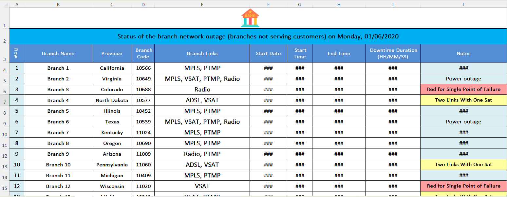
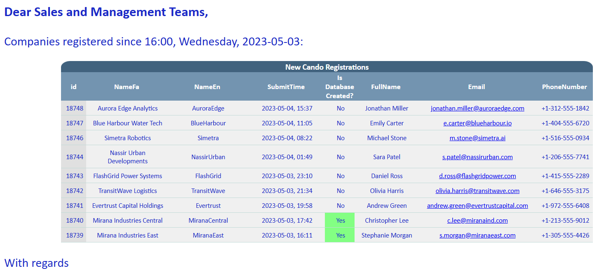
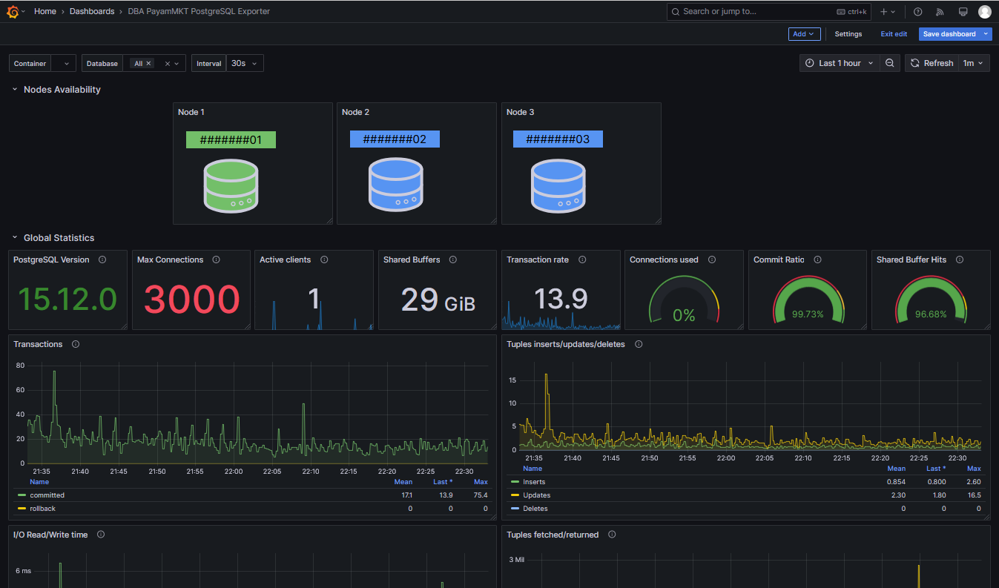
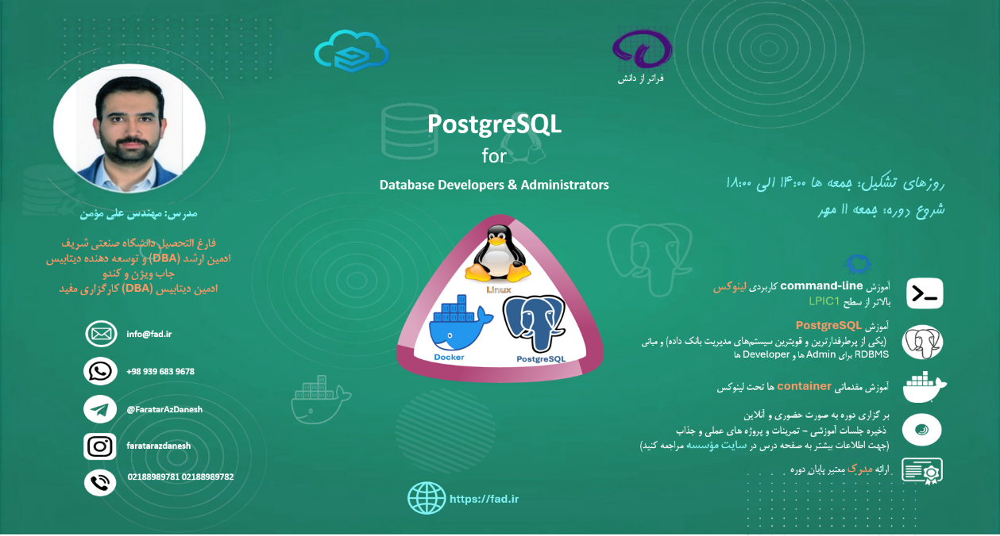
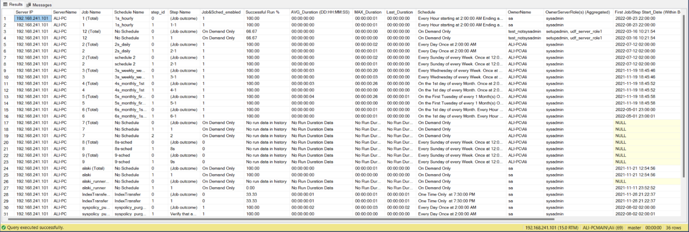

**Portfolio — Ali Momen**

**Name:** Ali Momen

**Email:** <amomen@gmail.com>

**Phone:** +31634397167

**Location:** Leiden, Netherlands

**Last Update:** 10/10/2025

**Current Occupation:** Just started Master’s program in Data Science
and Artificial Intelligence at Leiden University

**Portfolio statement:** I combine a decade of production‑grade database
engineering and automation with teaching and applied analytics; my work
focuses on reliable data infrastructure, reproducible analysis, and
deployable analytics for high‑stakes domains.

## Selected projects 

These projects were carried out for personal interests or from mostly
the last 2 job positions

**1. Automatic country‑wide branch downtime report — Keshavarzi Bank
(Jan 2021)**

**Role:** Network engineer, (DBA & data automation).

**Scope:** Nationwide report consolidating branch availability metrics
and automated alerting.

**Tools & methods:** T‑SQL, R, scheduled jobs; reporting pipeline;
clustered SQL Server environment.

**Outcome / impact:**

Contribution for the following: 100%

Reduced manual reporting effort and error and improved operational
visibility for reporting outages for the bank’s more than 1700 branches
country-wide (<https://en.wikipedia.org/wiki/Bank_Keshavarzi_Iran>). The
incidents also are relatively numerous due to various reasons including
power outage, unstable links, routers misconfigurations, and poor
maintenance services. Our team was composed of 12 members. Manual
reporting took more than an hour every day, was prone to errors, and was
inaccurate with respect to the time it was delivered. The automated
report was prepared and sent in a matter of seconds (Completely
effortless and time reduction from over an hour to 10 seconds overall).
The result, meaning the email body and spreadsheet attachment were
dynamically generated and conditionally formatted. The English
translation of an example figure of the spreadsheet file is below
(Employer data has been replaced by sample data):

The part of the article that is allowed by the employer to be published
publicly is on the link below:

<https://github.com/amomen9/SQLServer-DBA-Tools/blob/main/Send%20Formatted%20Excel%20File%20with%20Email/README.md>

**2. SQL Server cluster administration, legacy‑to‑modern migrations,
automation of dynamic database creation for every B2B customer,
designing a procedure for the complex task of multi-tenant database
migrations and new database creation — JobVision & HRCando (Nov 2021 –
Nov 2023)**

**Role:** Senior Database, Data Developer & Administrator; led
migrations and cross‑administration procedures

**Scope:** Plan and execute migrations from legacy systems to modern
DBMS; implement HA/cluster patterns and cross‑admin procedures.

**Tools & methods:** SQL Server clustering, migration scripts, CI/CD for
DB deployments.

**Outcome / impact:**

Team members (Database Development and Administration, Data Reporting,
ETL and BI Development, Data Analysis): 1 (myself)

Contribution for the following: 100%

- Improved reliability and maintainability of production systems. High
  quality data and schema legacy-to-modern migration (ETL) in a
  complicated and revolutionary migration task for an RDBMS with strict
  schema regulations, to cancel data loss for the current legacy system
  customers. The complexity was because the database system was turned
  into a multi-tenant database system with one database for every B2B
  customer from a monolithic database for all the customers. In the
  legacy system, much of the data was not normalized or was not in
  standard format and needed cleansing and transform. The relations had
  to be respected and new relations had to be defined, some data was
  transposed, schema changed significantly, and many multi-tenant
  databases had to be built out of one monolithic database.

- The proposed and carried out complicated multi-tenant B2B database
  migrations procedure and automated online database creation saved
  incredible time and effort and prevented data or schema
  inconsistencies and human errors while the same application connected
  to different B2B databases using ORM. The new databases were created
  in a matter of seconds. This also made this aim possible to allow the
  business operators to be able to create new databases with the
  required parameters from the application dashboard. By the time I left
  the company more than 220 B2B databases had been created on the
  instance.\
  The joint migration task with the developers team was also seamless,
  version controlled, fast, and easy-to-rollback in case of incidents
  and migration aborts by the b ackend developers team. It was being
  carried out online, and despite the high volume of databases (=220)
  the schema/data migrations did not typically take more than 1 minute
  for all of the databases serially.

- The sophisticated procedure of securely transferring and masking data
  from production to the test and staging environment for CI/CD
  purposes, making the developers able to also perform performance tests

- The proposed and carried out scheduled automated customer registration
  reports, made the managers and sales specialists capable not to miss
  important customer registrations and easily get their hands on their
  contact details. The moment a customer registered, the respective team
  was notified, and later as a daily report, the list of registered
  customers since the last report was dispatched to the team as a
  reminder. This is a sample of the report sent on a schedule that got
  its data from the database:

**3. Automation & monitoring across multi‑platform DB environments —
Fanap Soft (Jun 2021 – Nov 2021)**

**Role:** Database Administrator; automated processes via Bash and
T‑SQL; cross‑platform monitoring

**Scope:** Implement automated maintenance, monitoring dashboards, and
alerting across SQL Server, PostgreSQL, MySQL.

**Tools & methods:** Bash automation, monitoring tools (Zabbix, Red
Gate, Grafana), T‑SQL jobs.

**Example of Automation Scripts:**

Team members count: 4

My contribution to the following scripts: 100%

- PostgreSQL systemd Backup Automation:

<!-- -->

- <https://github.com/amomen9/PostgreSQL/blob/main/Backup/systemd%20Backup%20Automation/patroni.md>

Scripts combined with systemd services to execute automatically:

- Drop Unused Index

<!-- -->

- <https://github.com/amomen9/PostgreSQL/tree/main/Bash%20Scripts/Index%20Maintenance/Drop%20Unused%20Indexes>

<!-- -->

- Reindex

<!-- -->

- <https://github.com/amomen9/PostgreSQL/tree/main/Bash%20Scripts/Index%20Maintenance/Index%20Rebuild/Reindex%20User%20Tables>

<!-- -->

- Purge Binary Logs

<!-- -->

- <https://github.com/amomen9/MySQL-MariaDB/blob/main/Purge%20Binary%20Logs/Readme.md>

**Grafana Monitoring:**

Contribution: 100%

Creating and developing a customized PostgreSQL Grafana Monitoring
dashboard and performing the following:

- Using the following exporters to gather the performance and status
  data of PostgreSQL services. This data was gathered and stored inside
  Prometheus for monitoring purposes.

> Later, the Grafana dashboards used Prometheus as a data source to
> obtain the collected measures scraped by Prometheus and visualize them
> with various visuals, including time series visuals.
>
> prometheus-haproxy-exporter\
> prometheus-node-exporter\
> prometheus-pgbouncer-exporter\
> prometheus-postgres-exporter

- Defining custom queries for prometheus-postgres-exporter to further
  define custom metrics. The Percona PMM monitoring module also provides
  useful queries.

- Keeping a base JSON as a **dashboard template** to further develop
  exclusive dashboards for various purpose PostgreSQL services

Sample figure of a 3-node PostgreSQL cluster Grafana monitoring
dashboard utilizing Prometheus and direct postgres data sources.

This sample was our custom dashboard which is a development over the
PostgreSQL exporter template dashboard which exists on the **Grafana
dashboards** website.

The JSON for this dashboard exists on the following link on my GitHub
PostgreSQL repository:

<https://github.com/amomen9/PostgreSQL/blob/main/Monitoring/Grafana/DBA%20PostgreSQL%20Exporter-1760555550358.json>

For an example clarification, the green node is the primary node which
owns the floating Virtual IP Address (VIP). The nodes are the secondary
nodes. This monitors which node is the primary node. It also serves as a
health check for the nodes and the nodes that are not visible by the
monitoring server will turn gray in the dashboard:

**4. Network engineering and DB support — Keshavarzi Bank (Mar 2020 –
Apr 2021)**

**Role:** Network engineer, database developer & administrator; managed
SQL Server clusters and Cisco troubleshooting

**Scope:** Maintain mission‑critical systems, ensure high availability
and secure connectivity.

**Tools & methods:** Cisco device troubleshooting, T‑SQL analytics,
cluster ops.

Team members: around 10

My contribution: varies on each task

- Investigating Branch outage reasons and altering the configurations of
  the network devices such as ACL, routing, tunnels, etc when necessary:
  Equal contribution between all team members.

- Working with network monitoring solutions such as WhatsUp, Solar Winds
  Orion, Op Manager, Bina, and PRTG: Equal contribution between all team
  members.

- Because many Network Monitoring tools such as Op Manager, WhatsUp, and
  Solar Winds Databases reside on open queryable DBMSs, I manually
  queried data and made very custom reports for traffic anomaly, link
  quality, outages, unusual behavior compared to the device’s common
  behavior (like extremely low or extremely high traffic at a particular
  time), server metrics, etc. My contribution: 100%

- The uptime improvement of the databases were made certain of by
  investigating and identifying the cause of the incidents and reporting
  them to the authorities to rectify the mechanism of the infrastructure
  for a better reliability. Some common causes were contended with to
  avoid their recurrence. Some device misconfiguration were resolved.
  The links behaviors were monitored, so that the weak links would be
  identified. Outdated and legacy network devices that needed to be
  replaced by more heavy duty models where reported. Servers metrics
  where monitored to avoid interruption of their service. Incident mean
  time to resolution was normally not more than 10 minutes (from the
  real time of incident to resolution) but the security measures of the
  system like VPN and multiple 2FAs blunted our reaction sometimes. And
  finally, junior team members were trained to be able to tackle their
  tasks faster and more efficiently which also improves RTO in the event
  of a disaster: Equal contribution between all team members.

**5. International Students Office IT & International Communications
Specialist — Sharif University (Feb 2015)**

**Role & scope:** Technical support and communication systems for
international office; implemented IT workflows

Team size: 2

Contribution for the following roles: 100%

Virtual infrastructure to host the International Students Office (ISO)
website. Designing application forms and other parts of the website,
which mechanized the manual application process that was unbefitting for
a prestigious university. Correspondence with the international students
in English, and following up their academic needs and issues.

The then International Students Office (ISO) website was removed and
retired more than 7 years ago. One of the latest snapshots is the
following

[International Students Office (ISO) - Sharif University of
Technology](https://web.archive.org/web/20230822163552/http:/iso.sharif.ir/en)

**6. Teaching and mentoring — Faratar az Danesh, Rouzbeh Institute,
Polytechnic High School, Mofid Securities (Sep 2011–present)**

**Role:** Instructor for RDBMS (PostgreSQL), Linux, DB administration;
high‑school mathematics and Olympiad coaching

**Scope & methods:** Course design, hands‑on labs, mentoring DBA teams.

**Outcome / impact:** Trained DBAs and students who moved to production
roles.

- **Course:** PostgreSQL for Database Developers and Administrators (FAD
  institute)

  - Course link to syllabus:\
    <https://fad.ir/Course/Details/145>

  - Course contents (Session recordings & slides):\
    [shared
    DOCs](https://1drv.ms/f/c/ef69c869ed815671/EkHasdImIwJHvihqEx0LEKYBWFfZs8gOn0HDN_hOMOa3ZQ?e=AnsKJd)

- **Course:** Advanced PostgreSQL for Database Administrators (FAD
  institute)

  - Course link to syllabus:\
    <https://fad.ir/Course/Details/146>

Course Poster:

- Written document for PostgreSQL course on GitHub:\
  <https://github.com/amomen9/PostgreSQL/tree/main/PostgreSQL%20Course>

- **Presentation:**

  - Teaching training courses for the DBA team members on PostgreSQL
    (Mofid Securities)

  - Teaching Linux courses to the DBA Team members (Mofid Securities)

  - Delivering some presentations on Network concepts in Firewall,
    iptables (& nftables), SDN, Proxy & Reverse Proxy, SSL, DNS, CDN,
    NAT, etc.

**Selected outputs and projects:**

Many useful documents and scripts on GitHub:

<https://github.com/amomen9>

Examples:

- PostgreSQL useful scripts:\
  <https://github.com/amomen9/PostgreSQL/tree/main/Useful%20Scripts>

- MSSQL backup and restore history report\
  <https://github.com/amomen9/SQLServer-DBA-Tools/tree/main/Backup%20%26%20Restore%20History%20Report>

- MSSQL monitoring scripts\
  <https://github.com/amomen9/SQLServer-DBA-Tools/tree/main/MonitorServer%20(WhatIsActive)>

- MSSQL Partitioning Information\
  <https://github.com/amomen9/SQLServer-DBA-Tools/tree/main/Partitioning%20View%20Info>

- MSSQL Permissions\
  <https://github.com/amomen9/SQLServer-DBA-Tools/tree/main/Permissions>

- RedGate Overall Waits for MSSQL\
  <https://github.com/amomen9/SQLServer-DBA-Tools/tree/main/RedGate%20Overall%20Waits>

- MSSQL Restore Latest Backups Using msdb and sys.master_files\
  <https://github.com/amomen9/SQLServer-DBA-Tools/tree/main/Restore%20Latest%20Backups>

- MSSQL job info\
  <https://github.com/amomen9/SQLServer-DBA-Tools/tree/main/sp_JobsInfo>\

  

  
  

- PostgreSQL Patroni\
  <https://github.com/amomen9/PostgreSQL/tree/main/Patroni>

- PostgreSQL pgbouncer\
  <https://github.com/amomen9/PostgreSQL/tree/main/PGBouncer>

- PostgreSQL, a guide on how to upgrade the major version\
  <https://github.com/amomen9/PostgreSQL/tree/main/PostgreSQL%20Major%20Version%20Upgrade>

- PostgreSQL, Resetting WAL segment sizes\
  <https://github.com/amomen9/PostgreSQL/tree/main/Resetting%20WAL%20Segments'%20Sizes%20-%20Doc>

And many more.

**Skills summary:**

**Programming & data science:** Python; R; Stata; MATLAB; C/C++; Java

**Databases & tools:** Microsoft SQL Server (admin, clustering);
PostgreSQL (cluster admin, Replication, HA, and Disaster Recovery
concepts and tools); MySQL/MariaDB; MongoDB; T‑SQL; Pl/PgSQL Data
migrations; CI/CD; IaC

**Other:** Shell scripting (Bash), Windows Server, Cisco networks, BI
(SSAS/SSIS), PowerShell, API & Web services,
containerization/orchestration, version control

**Languages:** Persian (native) C2; English (fluent) C1; German
(working) B1; French (basic) A2

**Portfolio appendix — short CV**

Linkedin URL:

<https://www.linkedin.com/in/ali-momen>

GitHub URL:

<https://github.com/amomen9>

Complete CV is submitted as one of the documents

**Education:** BSc Applied Mathematics, Sharif University of Technology,
2006–2014; GPA 12.42 / 20

**Work experience (high level):**

- Faratar az Danesh — Linux & RDBMS Instructor (Sep 2024 – Present)

- Mofid Securities — DBMS DBA – Senior Database Administrator and
  Developer – Automated processes developer (Nov 2023 – Present)

- JobVision & HRCando — Senior Database, Data Developer & Administrator
  (Nov 2021 – Nov 2023)

- Fanap Soft — Database Administrator (Jun 2021 – Nov 2021)

- Keshavarzi Bank — Network Engineer & DBA (Mar 2020 – Apr 2021)

- Iratec Kish & Savintf — Web Developer & DBA (May 2017 – Mar 2020)

- FanamoozSanat & HydraSanat‑Tadbir — Full Stack Web Developer (May 2007
  – Feb 2015)

> **Certifications:** SQL Server administration; Microsoft BI SSAS/SSIS;
> PowerShell; API & Web Services; T‑SQL; others listed in CV
>
> **References:** Parviz Aghasadeghi (CEO, Faratar az Danesh) —
> aghasadeghi@fad.ir; Dr. Meghdad Velaei (CEO, JobVision) —
> m.velaei@jobvision.ir; Rasool Yekta (CTO, JobVision & HRCando); Mohsen
> Sayadian (DBA Lead, Mofid) — m.sayadian@emofid.com
